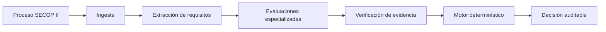
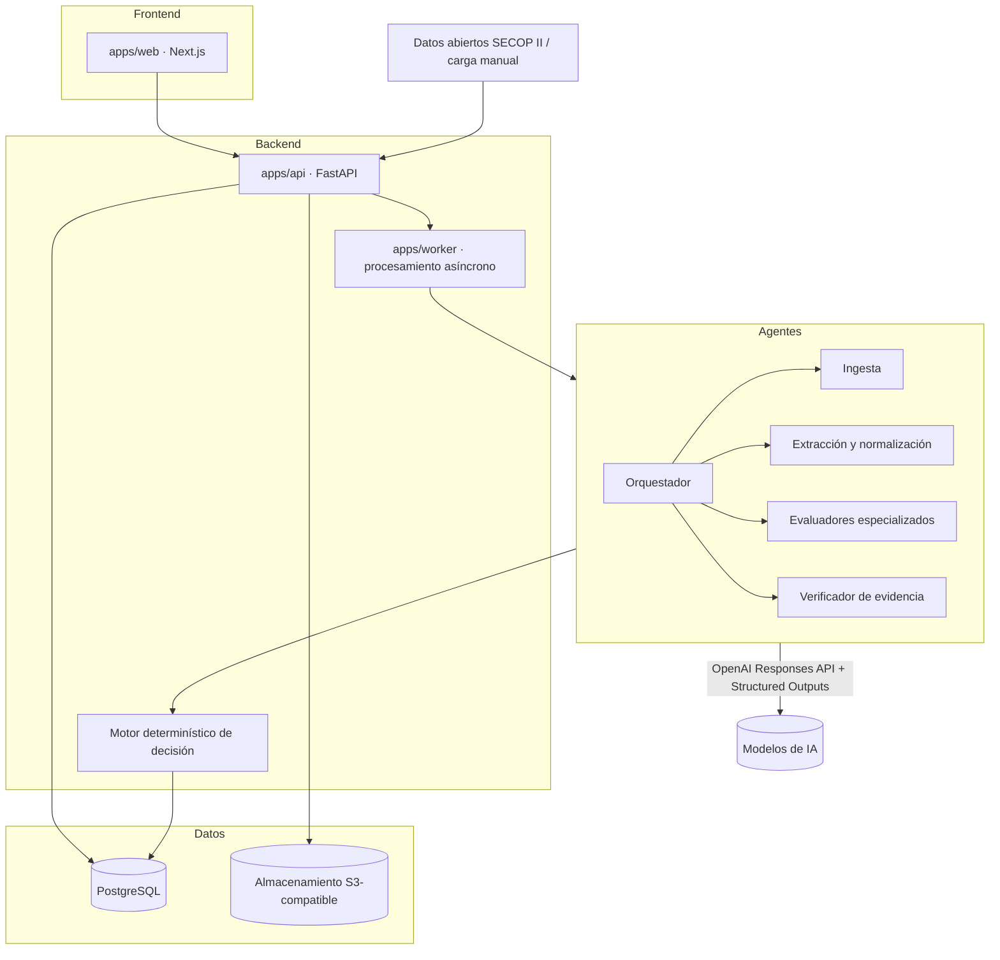

# PliegoCheck-SECOP

Microfase 20 agrega entrega externa controlada de alertas mediante outbox PostgreSQL, correo SMTP y webhook HTTPS firmado, deshabilitados por defecto y con dry-run activo. Consulte [entrega de notificaciones](docs/notification-delivery.md), [runbook de piloto](docs/notification-pilot-runbook.md) y [ADR-020](docs/ADR-020-external-alert-delivery.md).

Microfase 19 añade monitores SECOP periódicos, baseline incremental y alertas internas deduplicadas en `/monitors` y `/alerts`. La programación usa PostgreSQL y permanece deshabilitada por defecto; consulte [operación de monitores](docs/opportunity-monitor-operations.md) y [ADR-019](docs/ADR-019-opportunity-monitoring-alerts.md).

Plataforma multiagente de análisis **GO / NO GO** para procesos de contratación pública publicados en **SECOP II** (Colombia).

> ⚠️ **Advertencia:** el resultado producido por PliegoCheck es un **apoyo para la decisión de participar o no en un proceso**. No reemplaza la revisión jurídica, financiera ni contractual realizada por profesionales. Toda decisión crítica debe pasar por revisión humana.

---

## Problema que resuelve

Decidir si una empresa debe presentarse a un proceso de contratación pública exige leer pliegos extensos, anexos, adendas y formatos; verificar requisitos habilitantes jurídicos, financieros, técnicos y de experiencia; contrastarlos contra la capacidad real de la empresa (RUP, indicadores financieros, experiencia acreditable, equipo, códigos UNSPSC); e identificar causales insubsanables antes de invertir tiempo en preparar una oferta.

Ese análisis es hoy manual, lento, propenso a omisiones y difícil de auditar. PliegoCheck estructura ese trabajo: ingesta el proceso y sus documentos, extrae y normaliza los requisitos, los evalúa contra el perfil de la empresa y produce una **decisión auditable con evidencia trazable**.

## Usuarios objetivo

- Empresas que participan en contratación pública colombiana (constructoras, consultoras, proveedoras de bienes y servicios).
- Áreas de licitaciones que evalúan múltiples procesos por semana.
- Asesores y estructuradores de propuestas que necesitan un diagnóstico rápido y trazable.

## Alcance inicial

- Procesos publicados en SECOP II, obtenidos por **datos abiertos de Colombia Compra Eficiente** y por **carga manual de documentos**.
- Análisis de requisitos habilitantes y condiciones del proceso contra un perfil de empresa mantenido en la plataforma.
- Decisión estructurada con evidencia, generada por un **motor determinístico** alimentado por agentes de IA especializados.

Fuera del alcance inicial: presentación automática de ofertas, firma de documentos, interacción directa con la plataforma transaccional de SECOP II y cualquier decisión jurídica automática sin revisión humana.

## Estados posibles de decisión

| Estado | Significado |
| --- | --- |
| `GO` | No se detectan bloqueos con la evidencia disponible. |
| `GO_CONDICIONADO` | Puede participar si completa acciones o soportes pendientes (subsanables, con plan, responsable y fecha). |
| `BUSCAR_ALIADO` | Requiere consorcio, unión temporal o aliado para complementar capacidad (financiera, técnica o de experiencia). |
| `NO_GO` | Existe incumplimiento relevante o inviabilidad para este proceso. |
| `NO_CARGAR` | Existe una causal insubsanable o un riesgo crítico que impide presentar la oferta. |
| `PENDIENTE_INFORMACION` | No hay evidencia suficiente para tomar una decisión responsable. |

Regla central: **la ausencia de evidencia nunca produce `GO`**; produce `PENDIENTE_INFORMACION`.

## Flujo general



1. **Ingesta**: se registra el proceso (datos abiertos o carga manual) y se inventarían sus documentos.
2. **Extracción**: se extrae el contenido de pliegos y anexos y se normalizan los requisitos con referencia a documento, página y sección.
3. **Evaluaciones especializadas**: agentes jurídico, financiero, de experiencia, técnico, operativo y económico contrastan requisitos contra el perfil de la empresa.
4. **Verificación de evidencia**: se valida que cada hallazgo relevante apunte a evidencia real y se detectan conflictos.
5. **Motor determinístico**: reglas verificables (no el LLM) combinan los estados de los requisitos y producen la decisión.
6. **Decisión auditable**: el resultado incluye requisitos, evidencia, reglas aplicadas y versiones de prompts y modelo.

## Principios de diseño

- **Evidencia antes que confianza**: toda afirmación relevante apunta a un documento, página o sección; la confianza del modelo no reemplaza la evidencia.
- **Separación inferencia / decisión**: los agentes LLM extraen y evalúan; la decisión final la produce un motor determinístico con reglas versionadas.
- **Incertidumbre explícita**: lo desconocido se marca `UNKNOWN`, nunca se inventa.
- **Trazabilidad completa**: requisito → evidencia → evaluación → regla → decisión, con versiones de prompt y modelo registradas.
- **Revisión humana obligatoria** para decisiones críticas, evidencia contradictoria o ambigüedad jurídica.
- **Nada específico de un proceso se convierte en regla universal**: umbrales, documentos exigidos y causales dependen de cada pliego.

## Arquitectura conceptual



La decisión de stack y sus alternativas están formalizadas en [docs/ADR-001-stack-and-architecture.md](docs/ADR-001-stack-and-architecture.md).

## Estado actual - Microfase 17

Implementado: importacion manual de procesos, carga documental segura, almacenamiento local con
SHA-256, cola transaccional inicial, extractores deterministas para PDF con texto, DOCX, XLSX, CSV y
TXT, inventario documental, reintentos, segmentos paginados, normalizacion de requisitos con OpenAI
Responses API, Structured Outputs, prompts versionados, snapshot reproducible, batching
deterministico, validacion de evidencia, candidatos rechazados, relaciones, UI de revision de
requisitos, perfiles de empresa, datos juridicos, RUP, UNSPSC, finanzas, experiencia, personal,
certificaciones, capacidades, evidencias documentales reutilizando el pipeline de extraccion,
vinculos dato-evidencia, completitud deterministica, snapshots inmutables de perfil, evaluacion
financiera inicial por requisito, formulas financieras versionadas, cola PostgreSQL, worker
financiero, API, UI y revision manual auditada de resultados, motor deterministico de decision
preliminar, politica versionada, cobertura por categoria, reglas de precedencia, cola PostgreSQL de
decision, acciones, review/override auditados, evals y UI de decision preliminar.
Tambien estan implementados los evaluadores especializados deterministas juridico, de experiencia
y tecnico: reglas persistidas por requisito, resolucion contra snapshot publicado, cola PostgreSQL,
worker, API, UI, revision auditada, adaptadores hacia el motor de decision, contratos compartidos,
pruebas y evals.
La Microfase 9 agrega reporte ejecutivo y paquete de decision: contratos compartidos, tablas
`decision_report_*`, cola PostgreSQL, worker, templates versionados, artefactos HTML/Markdown/JSON/
CSV/manifest/ZIP, descargas API, panel web, pruebas y evals. El reporte resume una decision
preliminar completada; no recalcula evaluaciones, no modifica acciones y no reemplaza revision
juridica ni decision humana.
La Microfase 10 agrega autenticacion local, sesiones HttpOnly, roles y permisos, proteccion de API
y web, auditoria operacional, headers de seguridad, readiness operativo, scripts de backup local,
pantallas admin minimas y checklist de piloto.
La Microfase 11 agrega un **piloto controlado end-to-end con datos sinteticos**: dataset en `pilot/`,
comandos `pnpm pilot:prepare|run|reset|readiness`, un eval end-to-end con auth (`evals/pilot-end-to-end`)
que ejecuta proceso -> documentos -> extraccion -> normalizacion controlada -> empresa/snapshot ->
evaluaciones financiera y especializadas -> decision -> reporte -> descarga ZIP -> auditoria,
guion de demo, checklist, registro de retroalimentacion y contratos de piloto. No usa OpenAI ni datos
reales; el resultado honesto del dataset es `PENDIENTE_INFORMACION` (no forzado a GO). Detalle en
[docs/pilot-dataset.md](docs/pilot-dataset.md) y [docs/ADR-011-controlled-pilot.md](docs/ADR-011-controlled-pilot.md).
La Microfase 12 prepara una **release candidate de despliegue controlado**: clasifica hallazgos
post-piloto, agrega `pnpm deployment:eval`, `pnpm deployment:backup-check`, perfiles `.env`
local/piloto, runbook de despliegue controlado, checklist de navegador, pre/post deployment,
rollback, observabilidad local y documentacion de release candidate. Controlado/piloto no equivale a
produccion.
La Microfase 13 convierte esa preparacion en un **flujo controlado validable por usuarios piloto**:
agrega `compose.pilot.yaml`, scripts `pnpm controlled:*`, eval de controlled deployment, data scan
contra datos reales/secretos/rutas fisicas, kit de validacion por rol, formulario de feedback,
matriz de hallazgos, acta plantilla, guia de observacion y release candidate `0.13.0-rc.1`. Este
despliegue controlado usa datos sinteticos y no es produccion.
La Microfase 14 cierra el **MVP controlado**: consolida hallazgos finales, declara alcance y
limitaciones, agrega criterios de aceptacion/no produccion, guia de demo final, checklist de cierre,
indice de entrega, `pnpm mvp:eval`, `pnpm mvp:data-scan` y release candidate
`0.14.0-mvp-controlled`. No se recibió retroalimentación real de usuarios piloto en esta microfase.

La Microfase 16 agrega búsqueda e importación controlada desde las APIs públicas oficiales de Datos
Abiertos para procesos SECOP II y SECOP I. Incluye catálogo trazable, filtros y paginación,
normalización conservadora, persistencia, deduplicación, auditoría, permisos, API, UI, fixtures
offline y smoke live opt-in. Importar no descarga documentos, no ejecuta evaluaciones ni automatiza
ofertas o trámites SECOP. Detalle en [docs/secop-connector.md](docs/secop-connector.md).

La Microfase 17 agrega sincronizacion incremental, inventario documental SECOP I/II, snapshots y
eventos, descarga publica explicita con limites y proteccion SSRF, hash/deduplicacion, versiones
inmutables, cola PostgreSQL, worker, API y panel web. La extraccion sigue siendo una accion separada
y no se inicia ninguna evaluacion o decision.

No implementado todavía: OCR, scheduler automatico de documentos SECOP, SSO/MFA y S3 real
obligatorio.
Categorias fuera de los adaptadores financiero, juridico, experiencia y tecnico quedan
`NOT_EVALUATED`, por lo que no pueden producir `GO`.

## Desarrollo local

Requisitos: Node.js 22 (LTS), pnpm 11 (vía `packageManager`/corepack), Python 3.12 y [uv](https://docs.astral.sh/uv/).

```bash
pnpm install            # dependencias Node (workspace pnpm)
uv sync --all-packages  # dependencias Python (workspace uv)
```

| Comando | Qué hace |
| --- | --- |
| `pnpm dev:web` | Frontend Next.js en modo desarrollo |
| `pnpm dev:api` | API FastAPI con recarga (puerto 8000; OpenAPI en `/docs`) |
| `pnpm worker:health` | Diagnóstico del worker (imprime JSON y termina) |
| `pnpm worker:run-once` / `pnpm worker:drain` | Procesa uno o varios trabajos de extraccion documental |
| `pnpm normalization:run-once` / `pnpm normalization:drain` | Procesa trabajos de normalizacion de requisitos |
| `pnpm normalization:test` / `pnpm normalization:eval` | Pruebas y evals deterministas de normalizacion |
| `pnpm normalization:smoke` | Smoke manual opcional contra OpenAI si hay clave autorizada |
| `pnpm company:test` / `pnpm company:snapshot-check` | Pruebas de perfil de empresa, evidencias y snapshot deterministico |
| `pnpm financial:run-once` / `pnpm financial:drain` | Procesa trabajos de evaluacion financiera |
| `pnpm financial:test` / `pnpm financial:eval` | Pruebas y evals deterministas de evaluacion financiera |
| `pnpm specialized:run-once` / `pnpm specialized:drain` | Procesa trabajos de evaluadores juridico, experiencia y tecnico |
| `pnpm specialized:test` / `pnpm specialized:eval` | Pruebas y evals deterministas de evaluadores especializados |
| `pnpm decision:run-once` / `pnpm decision:drain` | Procesa trabajos de decision preliminar |
| `pnpm secop:test` / `pnpm secop:eval` | Pruebas y evals offline del conector SECOP |
| `pnpm secop:smoke` | Smoke live manual de un registro, deshabilitado por defecto |
| `pnpm decision:policy-check` / `pnpm decision:test` / `pnpm decision:eval` | Politica, pruebas y evals del motor de decision |
| `pnpm report:run-once` / `pnpm report:drain` | Procesa trabajos de reporte ejecutivo y paquete de decision |
| `pnpm report:test` / `pnpm report:eval` | Pruebas y evals deterministas de reportes |
| `pnpm auth:test` / `pnpm pilot:eval` | Pruebas de autenticacion y eval end-to-end de piloto |
| `pnpm pilot:prepare` / `pnpm pilot:run` | Siembra el dataset sintetico / ejecuta el flujo end-to-end |
| `pnpm pilot:readiness` / `pnpm pilot:reset --confirm` | Diagnostico de piloto / limpieza segura de datos de piloto |
| `pnpm deployment:eval` / `pnpm deployment:backup-check` | Smoke de despliegue controlado / verificacion de backup |
| `pnpm controlled:deploy` / `pnpm controlled:validate` | Levanta y valida entorno controlado para usuarios piloto |
| `pnpm controlled:stop` / `pnpm controlled:reset` | Detiene sin borrar / limpia con confirmacion el entorno controlado |
| `pnpm controlled:eval` / `pnpm controlled:data-scan` | Eval de sesion piloto / escaneo de datos reales, secretos y rutas |
| `pnpm mvp:eval` / `pnpm mvp:data-scan` | Eval de cierre MVP / data scan final del MVP controlado |
| `pnpm auth:create-admin` / `pnpm auth:list-users` | CLI administrativo de usuarios locales |
| `pnpm ops:backup` / `pnpm ops:restore` | Backup y restore local controlado |
| `pnpm infra:up` / `pnpm infra:down` | PostgreSQL local para desarrollo |
| `pnpm db:migrate` / `pnpm db:check` | Migraciones Alembic y verificación de divergencias |
| `pnpm schemas:generate` | Regenera JSON Schema y tipos TS desde el modelo canónico Pydantic |
| `pnpm schemas:check` | Verifica que el modelo canónico y lo generado estén sincronizados |
| `pnpm format` / `pnpm format:check` | Formato Prettier + Ruff |
| `pnpm lint` | ESLint + Ruff |
| `pnpm typecheck` | tsc + mypy |
| `pnpm test` | vitest + pytest |
| `pnpm extraction:test` | Pruebas dedicadas de worker/extractores y flujo API de extraccion |
| `pnpm build` | Build de producción de la web |
| `pnpm check` | Suite local integral (formato, lint, typecheck, tests, schemas, build) |

Guía completa en [docs/development.md](docs/development.md).

## Documentación disponible

- [Sincronizacion documental SECOP](docs/secop-document-sync.md): inventario incremental, descarga segura, worker y operacion.
- [Descubrimiento oficial de fuentes documentales](docs/secop-document-source-discovery.md): datasets, correlacion y limites observados.
- [ADR-017](docs/ADR-017-public-document-sync.md): decisiones de arquitectura y seguridad.

| Documento | Contenido |
| --- | --- |
| [AGENTS.md](AGENTS.md) | Reglas permanentes para agentes de programación que trabajen en este repositorio. |
| [docs/ADR-001-stack-and-architecture.md](docs/ADR-001-stack-and-architecture.md) | Decisión de stack y arquitectura objetivo, alternativas y consecuencias. |
| [docs/domain-model.md](docs/domain-model.md) | Entidades conceptuales del dominio y sus reglas de evidencia. |
| [docs/decision-engine.md](docs/decision-engine.md) | Especificación del motor determinístico de decisión. |
| [docs/agent-contracts.md](docs/agent-contracts.md) | Contratos de entrada/salida de cada agente de IA. |
| [docs/agent-prompting-standard.md](docs/agent-prompting-standard.md) | Estándar y plantillas para prompts de agentes. |
| [docs/security-and-governance.md](docs/security-and-governance.md) | Seguridad, gobernanza, amenazas y controles. |
| [docs/roadmap.md](docs/roadmap.md) | Roadmap incremental por microfases. |
| [docs/manual-import.md](docs/manual-import.md) | Flujo de importación manual, validaciones y límites. |
| [docs/ADR-002-manual-import-persistence.md](docs/ADR-002-manual-import-persistence.md) | Decisión de persistencia y almacenamiento local. |
| [docs/ADR-004-requirement-normalization.md](docs/ADR-004-requirement-normalization.md) | Decisión de arquitectura para normalizacion con IA y evidencia. |
| [docs/requirement-normalization.md](docs/requirement-normalization.md) | Operacion, API, prompts, provider, evals y limites de normalizacion. |
| [docs/ADR-005-company-profile-evidence.md](docs/ADR-005-company-profile-evidence.md) | Decisiones de perfil de empresa, evidencias reutilizadas y snapshots. |
| [docs/company-profile.md](docs/company-profile.md) | Modelo operativo de perfil de empresa y completitud. |
| [docs/company-evidence.md](docs/company-evidence.md) | Carga, extraccion y vinculacion dato-evidencia para soportes empresariales. |
| [docs/company-profile-snapshots.md](docs/company-profile-snapshots.md) | Snapshots inmutables de perfil y uso futuro por evaluadores. |
| [docs/ADR-006-financial-evaluation.md](docs/ADR-006-financial-evaluation.md) | Decision de arquitectura de evaluacion financiera inicial. |
| [docs/financial-evaluation.md](docs/financial-evaluation.md) | Operacion, API, worker, revision y limites de evaluacion financiera. |
| [docs/financial-formulas.md](docs/financial-formulas.md) | Formulas financieras versionadas y reglas de calculo. |
| [docs/ADR-007-deterministic-decision-engine.md](docs/ADR-007-deterministic-decision-engine.md) | Decision de arquitectura del motor deterministico preliminar. |
| [docs/ADR-008-specialized-evaluators.md](docs/ADR-008-specialized-evaluators.md) | Decision de arquitectura para evaluadores juridico, experiencia y tecnico. |
| [docs/specialized-evaluators.md](docs/specialized-evaluators.md) | Operacion, API, worker, evidencias y limites de evaluadores especializados. |
| [docs/legal-evaluation.md](docs/legal-evaluation.md) | Reglas juridicas deterministas y criterios de incertidumbre. |
| [docs/experience-evaluation.md](docs/experience-evaluation.md) | Reglas de experiencia, valor, conteo, UNSPSC y actividad. |
| [docs/technical-evaluation.md](docs/technical-evaluation.md) | Reglas tecnicas, personal, certificaciones, cobertura y capacidades. |
| [docs/decision-policy.md](docs/decision-policy.md) | Politica versionada, snapshot, digest e idempotencia. |
| [docs/decision-rules.md](docs/decision-rules.md) | Reglas, cobertura, hallazgos canonicos y acciones. |
| [docs/decision-outcomes.md](docs/decision-outcomes.md) | Significado y precedencia de resultados. |
| [docs/ADR-009-decision-report-package.md](docs/ADR-009-decision-report-package.md) | Decision de arquitectura para reporte ejecutivo y paquete de decision. |
| [docs/decision-report.md](docs/decision-report.md) | Operacion, API, worker y limites del reporte ejecutivo. |
| [docs/decision-package.md](docs/decision-package.md) | Contenido, manifest, ZIP e idempotencia del paquete. |
| [docs/report-artifacts.md](docs/report-artifacts.md) | Seguridad, storage, templates y evals de artefactos. |
| [docs/ADR-010-operational-hardening-auth.md](docs/ADR-010-operational-hardening-auth.md) | Decision de autenticacion local y endurecimiento operativo. |
| [docs/authentication.md](docs/authentication.md) | Login, sesiones, cookies y primer admin. |
| [docs/authorization.md](docs/authorization.md) | Roles y permisos. |
| [docs/operations-runbook.md](docs/operations-runbook.md) | Operacion local/piloto, health y auditoria. |
| [docs/pilot-readiness-checklist.md](docs/pilot-readiness-checklist.md) | Checklist pre-piloto. |
| [docs/security-hardening.md](docs/security-hardening.md) | Controles de seguridad implementados. |
| [docs/backup-restore.md](docs/backup-restore.md) | Backup y restore local. |
| [docs/ADR-011-controlled-pilot.md](docs/ADR-011-controlled-pilot.md) | Decision de arquitectura del piloto controlado. |
| [docs/ADR-012-post-pilot-deployment-readiness.md](docs/ADR-012-post-pilot-deployment-readiness.md) | Decision de preparacion post-piloto y deployment readiness. |
| [docs/ADR-013-controlled-deployment-user-validation.md](docs/ADR-013-controlled-deployment-user-validation.md) | Decision de despliegue controlado y validacion con usuarios piloto. |
| [docs/ADR-014-controlled-mvp-closure.md](docs/ADR-014-controlled-mvp-closure.md) | Decision de cierre del MVP controlado. |
| [docs/pilot-dataset.md](docs/pilot-dataset.md) | Dataset sintetico del piloto. |
| [docs/demo-script.md](docs/demo-script.md) | Guion de demo end-to-end. |
| [docs/pilot-demo-checklist.md](docs/pilot-demo-checklist.md) | Checklist de demo del piloto. |
| [docs/pilot-feedback-log.md](docs/pilot-feedback-log.md) | Registro de retroalimentacion del piloto. |
| [docs/post-pilot-findings.md](docs/post-pilot-findings.md) | Clasificacion de hallazgos post-piloto. |
| [docs/controlled-deployment-runbook.md](docs/controlled-deployment-runbook.md) | Runbook de despliegue controlado. |
| [docs/release-candidate.md](docs/release-candidate.md) | Release candidate y criterios de aceptacion/rollback. |
| [docs/user-pilot-readiness-checklist.md](docs/user-pilot-readiness-checklist.md) | Checklist de readiness para sesion con usuarios piloto. |
| [docs/user-pilot-findings.md](docs/user-pilot-findings.md) | Matriz inicial de hallazgos de usuarios piloto. |
| [docs/pilot-validation-minutes.md](docs/pilot-validation-minutes.md) | Plantilla de acta de validacion piloto. |
| [docs/pilot-observation-guide.md](docs/pilot-observation-guide.md) | Guia de observacion, logs, request id y evidencia. |
| [docs/mvp-final-findings.md](docs/mvp-final-findings.md) | Hallazgos finales del MVP controlado. |
| [docs/mvp-controlled-scope.md](docs/mvp-controlled-scope.md) | Alcance incluido y excluido del MVP controlado. |
| [docs/known-limitations.md](docs/known-limitations.md) | Limitaciones conocidas antes de piloto real o produccion. |
| [docs/mvp-acceptance-criteria.md](docs/mvp-acceptance-criteria.md) | Criterios de aceptacion del MVP controlado. |
| [docs/non-production-criteria.md](docs/non-production-criteria.md) | Condiciones que bloquean uso productivo. |
| [docs/final-demo-guide.md](docs/final-demo-guide.md) | Guia de demo final del MVP controlado. |
| [docs/mvp-closure-checklist.md](docs/mvp-closure-checklist.md) | Checklist de cierre del MVP controlado. |
| [docs/mvp-delivery-index.md](docs/mvp-delivery-index.md) | Indice de entrega del MVP controlado. |

## Roadmap resumido

| Microfase | Entregable |
| --- | --- |
| 0 | Fundación documental (este trabajo) |
| 1 | Esqueleto del monorepo |
| 2 | Importación manual de proceso y documentos |
| 3 | Inventario y extracción documental |
| 4 | Normalización de requisitos |
| 5 | Perfil de empresa y evidencias |
| 6 | Evaluador financiero inicial |
| 7 | Motor determinístico de decisión |
| 8 | Evaluadores especializados juridico, tecnico y de experiencia |
| 9 | Reporte ejecutivo y paquete de decision |
| 10 | Endurecimiento operativo, autenticacion y preparacion de piloto |
| 11 | Piloto controlado end-to-end con datos sinteticos y retroalimentacion |
| 12 | Ajustes post-piloto y preparacion de despliegue controlado |
| 13 | Despliegue controlado y validacion con usuarios piloto |
| 14 | Ajustes derivados de usuarios piloto y cierre de MVP controlado |
| 15 | Decision ejecutiva sobre evolucion a piloto real o pausa tecnica |

Detalle completo en [docs/roadmap.md](docs/roadmap.md).

## Bandeja de oportunidades SECOP

La ruta `/opportunities` descubre procesos públicos y los compara de forma determinística con un snapshot empresarial publicado. La política, componentes, outcomes, urgencia, información faltante, histórico, permisos y análisis profundo se documentan en [ADR-018](docs/ADR-018-opportunity-prioritization.md) y [docs/opportunity-compatibility.md](docs/opportunity-compatibility.md). Es una priorización para revisión humana; no presenta ofertas ni reemplaza los evaluadores o el motor de decisión.
