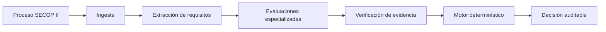
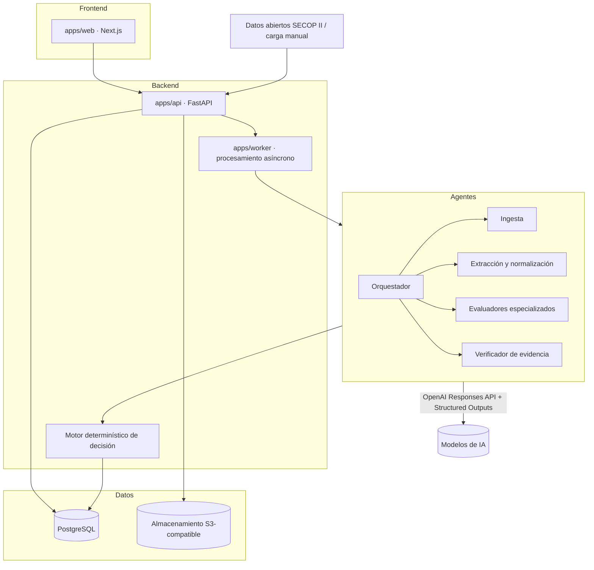

# PliegoCheck-SECOP

Plataforma multiagente de análisis **GO / NO GO** para procesos de contratación pública publicados en **SECOP II** (Colombia).

> ⚠️ **Advertencia:** el resultado producido por PliegoCheck es un **apoyo para la decisión de participar o no en un proceso**. No reemplaza la revisión jurídica, financiera ni contractual realizada por profesionales. Toda decisión crítica debe pasar por revisión humana.

---

## Problema que resuelve

Decidir si una empresa debe presentarse a un proceso de contratación pública exige leer pliegos extensos, anexos, adendas y formatos; verificar requisitos habilitantes jurídicos, financieros, técnicos y de experiencia; contrastarlos contra la capacidad real de la empresa (RUP, indicadores financieros, experiencia acreditable, equipo, códigos UNSPSC); e identificar causales insubsanables antes de invertir tiempo en preparar una oferta.

Ese análisis es hoy manual, lento, propenso a omisiones y difícil de auditar. PliegoCheck estructura ese trabajo: ingesta el proceso y sus documentos, extrae y normaliza los requisitos, los evalúa contra el perfil de la empresa y produce una **decisión auditable con evidencia trazable**.

## Usuarios objetivo

- Empresas que participan en contratación pública colombiana (constructoras, consultoras, proveedoras de bienes y servicios).
- Áreas de licitaciones que evalúan múltiples procesos por semana.
- Asesores y estructuradores de propuestas que necesitan un diagnóstico rápido y trazable.

## Alcance inicial

- Procesos publicados en SECOP II, obtenidos por **datos abiertos de Colombia Compra Eficiente** y por **carga manual de documentos**.
- Análisis de requisitos habilitantes y condiciones del proceso contra un perfil de empresa mantenido en la plataforma.
- Decisión estructurada con evidencia, generada por un **motor determinístico** alimentado por agentes de IA especializados.

Fuera del alcance inicial: presentación automática de ofertas, firma de documentos, interacción directa con la plataforma transaccional de SECOP II y cualquier decisión jurídica automática sin revisión humana.

## Estados posibles de decisión

| Estado | Significado |
| --- | --- |
| `GO` | No se detectan bloqueos con la evidencia disponible. |
| `GO_CONDICIONADO` | Puede participar si completa acciones o soportes pendientes (subsanables, con plan, responsable y fecha). |
| `BUSCAR_ALIADO` | Requiere consorcio, unión temporal o aliado para complementar capacidad (financiera, técnica o de experiencia). |
| `NO_GO` | Existe incumplimiento relevante o inviabilidad para este proceso. |
| `NO_CARGAR` | Existe una causal insubsanable o un riesgo crítico que impide presentar la oferta. |
| `PENDIENTE_INFORMACION` | No hay evidencia suficiente para tomar una decisión responsable. |

Regla central: **la ausencia de evidencia nunca produce `GO`**; produce `PENDIENTE_INFORMACION`.

## Flujo general



1. **Ingesta**: se registra el proceso (datos abiertos o carga manual) y se inventarían sus documentos.
2. **Extracción**: se extrae el contenido de pliegos y anexos y se normalizan los requisitos con referencia a documento, página y sección.
3. **Evaluaciones especializadas**: agentes jurídico, financiero, de experiencia, técnico, operativo y económico contrastan requisitos contra el perfil de la empresa.
4. **Verificación de evidencia**: se valida que cada hallazgo relevante apunte a evidencia real y se detectan conflictos.
5. **Motor determinístico**: reglas verificables (no el LLM) combinan los estados de los requisitos y producen la decisión.
6. **Decisión auditable**: el resultado incluye requisitos, evidencia, reglas aplicadas y versiones de prompts y modelo.

## Principios de diseño

- **Evidencia antes que confianza**: toda afirmación relevante apunta a un documento, página o sección; la confianza del modelo no reemplaza la evidencia.
- **Separación inferencia / decisión**: los agentes LLM extraen y evalúan; la decisión final la produce un motor determinístico con reglas versionadas.
- **Incertidumbre explícita**: lo desconocido se marca `UNKNOWN`, nunca se inventa.
- **Trazabilidad completa**: requisito → evidencia → evaluación → regla → decisión, con versiones de prompt y modelo registradas.
- **Revisión humana obligatoria** para decisiones críticas, evidencia contradictoria o ambigüedad jurídica.
- **Nada específico de un proceso se convierte en regla universal**: umbrales, documentos exigidos y causales dependen de cada pliego.

## Arquitectura conceptual



La decisión de stack y sus alternativas están formalizadas en [docs/ADR-001-stack-and-architecture.md](docs/ADR-001-stack-and-architecture.md).

## Estado actual - Microfase 4

Implementado: importacion manual de procesos, carga documental segura, almacenamiento local con
SHA-256, cola transaccional inicial, extractores deterministas para PDF con texto, DOCX, XLSX, CSV y
TXT, inventario documental, reintentos, segmentos paginados, normalizacion de requisitos con OpenAI
Responses API, Structured Outputs, prompts versionados, snapshot reproducible, batching
deterministico, validacion de evidencia, candidatos rechazados, relaciones y UI de revision.

No implementado todavia: OCR, evaluacion de cumplimiento, perfil de empresa, integracion automatica
con SECOP II, autenticacion, S3 real y motor GO / NO GO ejecutable. La normalizacion no evalua si una
empresa cumple ni produce decisiones.

## Desarrollo local

Requisitos: Node.js 22 (LTS), pnpm 11 (vía `packageManager`/corepack), Python 3.12 y [uv](https://docs.astral.sh/uv/).

```bash
pnpm install            # dependencias Node (workspace pnpm)
uv sync --all-packages  # dependencias Python (workspace uv)
```

| Comando | Qué hace |
| --- | --- |
| `pnpm dev:web` | Frontend Next.js en modo desarrollo |
| `pnpm dev:api` | API FastAPI con recarga (puerto 8000; OpenAPI en `/docs`) |
| `pnpm worker:health` | Diagnóstico del worker (imprime JSON y termina) |
| `pnpm worker:run-once` / `pnpm worker:drain` | Procesa uno o varios trabajos de extraccion documental |
| `pnpm normalization:run-once` / `pnpm normalization:drain` | Procesa trabajos de normalizacion de requisitos |
| `pnpm normalization:test` / `pnpm normalization:eval` | Pruebas y evals deterministas de normalizacion |
| `pnpm normalization:smoke` | Smoke manual opcional contra OpenAI si hay clave autorizada |
| `pnpm infra:up` / `pnpm infra:down` | PostgreSQL local para desarrollo |
| `pnpm db:migrate` / `pnpm db:check` | Migraciones Alembic y verificación de divergencias |
| `pnpm schemas:generate` | Regenera JSON Schema y tipos TS desde el modelo canónico Pydantic |
| `pnpm schemas:check` | Verifica que el modelo canónico y lo generado estén sincronizados |
| `pnpm format` / `pnpm format:check` | Formato Prettier + Ruff |
| `pnpm lint` | ESLint + Ruff |
| `pnpm typecheck` | tsc + mypy |
| `pnpm test` | vitest + pytest |
| `pnpm extraction:test` | Pruebas dedicadas de worker/extractores y flujo API de extraccion |
| `pnpm build` | Build de producción de la web |
| `pnpm check` | Suite local integral (formato, lint, typecheck, tests, schemas, build) |

Guía completa en [docs/development.md](docs/development.md).

## Documentación disponible

| Documento | Contenido |
| --- | --- |
| [AGENTS.md](AGENTS.md) | Reglas permanentes para agentes de programación que trabajen en este repositorio. |
| [docs/ADR-001-stack-and-architecture.md](docs/ADR-001-stack-and-architecture.md) | Decisión de stack y arquitectura objetivo, alternativas y consecuencias. |
| [docs/domain-model.md](docs/domain-model.md) | Entidades conceptuales del dominio y sus reglas de evidencia. |
| [docs/decision-engine.md](docs/decision-engine.md) | Especificación del motor determinístico de decisión. |
| [docs/agent-contracts.md](docs/agent-contracts.md) | Contratos de entrada/salida de cada agente de IA. |
| [docs/agent-prompting-standard.md](docs/agent-prompting-standard.md) | Estándar y plantillas para prompts de agentes. |
| [docs/security-and-governance.md](docs/security-and-governance.md) | Seguridad, gobernanza, amenazas y controles. |
| [docs/roadmap.md](docs/roadmap.md) | Roadmap incremental por microfases. |
| [docs/manual-import.md](docs/manual-import.md) | Flujo de importación manual, validaciones y límites. |
| [docs/ADR-002-manual-import-persistence.md](docs/ADR-002-manual-import-persistence.md) | Decisión de persistencia y almacenamiento local. |
| [docs/ADR-004-requirement-normalization.md](docs/ADR-004-requirement-normalization.md) | Decisión de arquitectura para normalizacion con IA y evidencia. |
| [docs/requirement-normalization.md](docs/requirement-normalization.md) | Operacion, API, prompts, provider, evals y limites de normalizacion. |

## Roadmap resumido

| Microfase | Entregable |
| --- | --- |
| 0 | Fundación documental (este trabajo) |
| 1 | Esqueleto del monorepo |
| 2 | Importación manual de proceso y documentos |
| 3 | Inventario y extracción documental |
| 4 | Normalización de requisitos |
| 5 | Perfil de empresa y evidencias |
| 6 | Evaluador financiero inicial |
| 7 | Motor determinístico de decisión |
| 8 | Explicación y reporte auditable |
| 9 | Integración con datos abiertos SECOP II |
| 10 | Autenticación, multiempresa y operación |

Detalle completo en [docs/roadmap.md](docs/roadmap.md).
