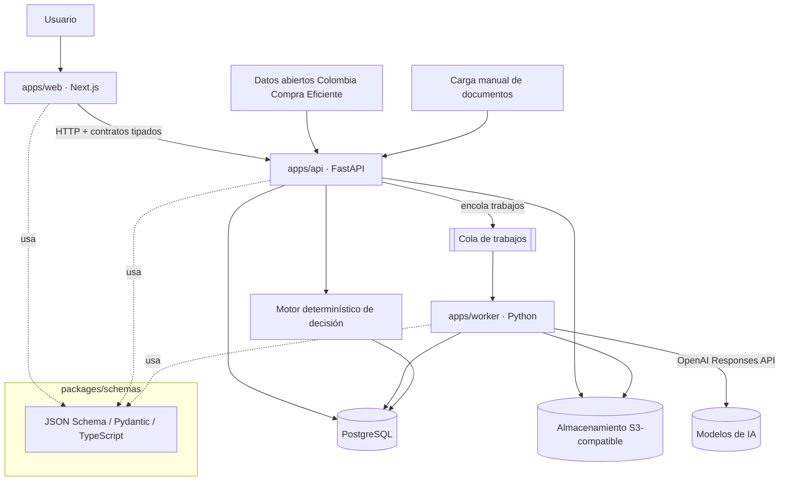

# ADR-001 — Stack tecnológico y arquitectura objetivo

- **Estado:** Aceptado
- **Fecha:** 2026-07-01
- **Decisores:** Equipo PliegoCheck

## Contexto

PliegoCheck-SECOP debe evolucionar de un repositorio vacío a una plataforma multiagente que analice procesos de SECOP II y produzca decisiones GO / NO GO auditables. El sistema combina tres naturalezas de trabajo distintas:

1. **Interfaz de usuario** para gestionar procesos, perfiles de empresa, evidencias y revisar decisiones.
2. **Procesamiento documental y de IA** de larga duración (descarga, extracción, normalización, evaluación), que no puede ejecutarse dentro del ciclo request/response de una petición web.
3. **Decisión determinística** con reglas versionadas, que exige reproducibilidad y trazabilidad estrictas.

Las restricciones del dominio (evidencia obligatoria, incertidumbre explícita, revisión humana, separación inferencia/decisión) están definidas en [domain-model.md](domain-model.md) y [decision-engine.md](decision-engine.md), y condicionan la arquitectura.

## Decisión

Adoptar un **monorepo** con separación de aplicaciones:

```text
Monorepo
├── apps/web       → Next.js + TypeScript (frontend)
├── apps/api       → Python + FastAPI (API y motor de decisión)
├── apps/worker    → Python (procesamiento asíncrono: documentos y agentes)
├── packages/schemas → contratos compartidos (JSON Schema como fuente; Pydantic y TypeScript derivados)
└── docs           → documentación y ADRs
```

Componentes previstos:

| Componente | Elección |
| --- | --- |
| Frontend | Next.js + TypeScript |
| API | FastAPI + Python |
| Contratos | Pydantic + JSON Schema compartidos entre web, api y worker |
| Base de datos | PostgreSQL |
| Migraciones | Alembic |
| Almacenamiento documental | Compatible con S3 (documentos originales inmutables) |
| Procesamiento en segundo plano | Cola de trabajos, incorporada **solo cuando el flujo lo necesite** (a partir de la extracción documental) |
| IA | OpenAI Responses API |
| Respuestas de agentes | Structured Outputs validadas contra esquema |
| Observabilidad | Eventos de ejecución: consumo de tokens, tiempos, errores, versiones de prompts y modelo |
| Fuente SECOP II | Datos abiertos de Colombia Compra Eficiente + carga manual de documentos |
| Motor de decisión | Componente determinístico **independiente del LLM**, dentro de `apps/api` |
| Despliegue | Contenedores; sin fijar todavía un proveedor único de nube |

**No se fijan versiones exactas de frameworks en este ADR.** Al iniciar la implementación (Microfase 1) se usarán las versiones estables compatibles vigentes, y quedarán registradas en los lockfiles del monorepo.

## Diagrama de componentes



## Alternativas consideradas y por qué se descartan inicialmente

### Aplicación monolítica exclusivamente en Next.js
Descartada. El procesamiento documental y las cadenas de agentes son trabajos largos, con reintentos y estado, que encajan mal en API routes serverless. El ecosistema Python es más maduro para extracción documental (PDF, DOCX, OCR) y para tooling de IA. Next.js queda donde aporta: la experiencia de usuario.

### Sistema completamente basado en prompts
Descartada. Delegar la decisión final al LLM viola el principio de separación inferencia/decisión: la decisión sería irreproducible, no auditable y vulnerable a alucinación. Los LLM extraen y evalúan; las reglas determinísticas versionadas deciden ([decision-engine.md](decision-engine.md)).

### Microservicios independientes desde el primer MVP
Descartada. Con un equipo pequeño y un dominio aún en descubrimiento, los microservicios agregan costo operativo (despliegue, red, contratos entre servicios, observabilidad distribuida) sin beneficio proporcional. El monorepo con tres apps mantiene fronteras claras y permite extraer servicios después si la escala lo exige.

### Vector database como requisito obligatorio inicial
Descartada como requisito. El flujo central (extraer requisitos → evaluar → decidir) opera sobre documentos concretos de un proceso concreto, con referencias exactas a página y sección. La búsqueda semántica puede añadirse después si un caso de uso la justifica; no condiciona la arquitectura.

### Scraping como única fuente de SECOP II
Descartada. El scraping de la plataforma transaccional es frágil y de legalidad operativa dudosa. La fuente primaria son los **datos abiertos de Colombia Compra Eficiente** (API pública de datos.gov.co), complementados con **carga manual** de los documentos del proceso, que además cubre los casos donde los datos abiertos no incluyen los anexos.

### Decisiones jurídicas automáticas sin revisión humana
Descartada de forma permanente, no solo inicial. El sistema nunca afirma certeza jurídica; toda decisión con ambigüedad jurídica, evidencia contradictoria o criticidad alta escala a revisión humana ([security-and-governance.md](security-and-governance.md)).

## Consecuencias

**Positivas**
- Fronteras claras entre UI, API/decisión y procesamiento pesado desde el día uno.
- Contratos compartidos (`packages/schemas`) evitan divergencia entre frontend, API y worker.
- El motor determinístico separado hace las decisiones reproducibles y auditables.
- Python en api/worker da acceso directo al mejor ecosistema de extracción documental y IA.

**Negativas / costos asumidos**
- Dos lenguajes (TypeScript y Python) exigen disciplina en la generación de contratos compartidos.
- El monorepo requiere tooling de orquestación local (se definirá en Microfase 1).
- La cola de trabajos introduce infraestructura adicional cuando se active (aceptado: se pospone hasta que el flujo la necesite).

## Riesgos

| Riesgo | Mitigación |
| --- | --- |
| Divergencia entre esquemas Pydantic y TypeScript | JSON Schema como fuente única; generación automática verificada en CI. |
| Dependencia de un solo proveedor de IA | Contratos de agentes independientes del proveedor; el proveedor es un detalle de `apps/worker`. |
| Datos abiertos incompletos (anexos faltantes) | La carga manual de documentos es vía de primera clase, no un fallback improvisado. |
| Costo de tokens sin control | Observabilidad de consumo por ejecución y límites por agente desde el diseño ([security-and-governance.md](security-and-governance.md)). |

## Registro de implementación — Microfase 1 (2026-07-01)

Decisiones concretas tomadas al materializar el esqueleto del monorepo:

| Decisión | Elección | Motivo |
| --- | --- | --- |
| Gestor de paquetes JS | pnpm 11 (workspaces, fijado con `packageManager`) | Workspaces nativos, lockfile estricto, sin herramienta adicional. |
| Gestor de paquetes Python | uv (workspace con `apps/api`, `apps/worker`, `packages/schemas`) | Un solo entorno para el monorepo, lockfile reproducible (`uv.lock`), instala el propio Python. |
| Versiones base | Node 22 LTS (`.nvmrc`), Python 3.12 (`.python-version`) | Estables y soportadas; resueltas realmente por los gestores: Next 15, React 19, TypeScript 5.9, FastAPI 0.139, Pydantic 2.13, pytest 9, mypy 2.1, Ruff 0.15. |
| Estrategia canónica de contratos | Modelo Pydantic → JSON Schema versionado → tipos TS generados (`json-schema-to-typescript`) + constantes de runtime | Una sola fuente de verdad; `pnpm schemas:check` en CI impide la divergencia silenciosa. |
| Calidad | Prettier + ESLint (typescript-eslint, flat config) / Ruff (lint+formato) + mypy `strict` / vitest + pytest | Cobertura equivalente en ambos ecosistemas con configuración raíz única. |
| Orquestación del monorepo | Solo scripts pnpm/uv + GitHub Actions; **sin Turborepo/Nx** | Con 3 apps y 1 paquete, los scripts son suficientes; una capa de orquestación se justificará solo cuando el grafo de tareas crezca. |
| Contenedores de desarrollo | Pospuestos | Sin base de datos ni servicios externos no hay entorno que aislar; llegarán con la infraestructura real (Microfase 2+). |
| ESLint de Next.js | No se usa `eslint-config-next` por ahora | El lint raíz (typescript-eslint) cubre el código actual con una sola configuración; se reevaluará si se necesitan las reglas específicas de Next. |

Límites de esta fase: sin base de datos, sin cola real (el worker es un CLI de diagnóstico), sin agentes de IA, sin integración SECOP II, sin autenticación y sin despliegue.

## Registro de implementación — Microfase 2 (2026-07-02)

Decisiones concretas tomadas al implementar la importación manual:

| Decisión | Elección | Motivo |
| --- | --- | --- |
| Persistencia | PostgreSQL + SQLAlchemy 2 + Alembic | Coincide con el stack objetivo y permite migraciones reproducibles desde base vacía. |
| Almacenamiento inicial | `LocalDocumentStorage` bajo `PLIEGOCHECK_STORAGE_PATH` | Suficiente para desarrollo y pruebas; mantiene una abstracción reemplazable por S3-compatible. |
| Comunicación web/API | Navegador → FastAPI con CORS restringido | Mantiene una sola frontera HTTP y evita mezclar BFF con llamadas directas en esta fase. |
| Contratos | Pydantic canónico → JSON Schema → TypeScript | La web y la API consumen contratos de procesos, documentos y carga desde `packages/schemas`. |
| Cola | Pospuesta | No hay extracción ni procesamiento asíncrono todavía; el worker informa `document_processing_enabled=false`. |

## Registro de implementacion - Microfase 4 (2026-07-02)

Decisiones concretas al materializar normalizacion de requisitos:

| Decision | Eleccion | Motivo |
| --- | --- | --- |
| Provider IA | OpenAI Responses API via SDK oficial Python | Mantiene el stack objetivo y permite Structured Outputs. |
| Aislamiento provider | `RequirementNormalizationProvider` con implementaciones OpenAI y fake | El dominio y el worker no dependen directamente del SDK. |
| Prompts | Archivos versionados bajo `prompts/requirement-normalization/v1` y `prompt_versions` en PostgreSQL | Reproducibilidad y auditoria de contenido exacto. |
| Snapshot | `input_manifest` + `input_digest` por run | Las extracciones nuevas no alteran ejecuciones historicas. |
| Evidencia | `EvidenceValidator` deterministico antes de persistir requisitos | Ningun requisito aceptado queda sin cita real. |
| UI | Seccion `Requisitos normalizados` en detalle de proceso | Revision humana, evidencia y advertencias visibles desde la web. |

## Registro de implementacion - Microfase 5 (2026-07-02)

Decisiones concretas al materializar perfiles de empresa y evidencias:

| Decision | Eleccion | Motivo |
| --- | --- | --- |
| Perfil editable | `CompanyProfile` con subentidades juridicas, RUP, UNSPSC, finanzas, experiencia, personal, certificaciones y capacidades | Separa datos declarados por dominio y evita tratar la empresa como un JSON opaco. |
| Evidencias | `CompanyEvidenceDocument` reutiliza `ProcessDocument`, `DocumentProcessingJob`, `DocumentExtraction` y `ExtractedSegment` mediante un proceso tecnico oculto | Evita duplicar el pipeline documental y mantiene hashes, extraccion y segmentos en el modelo ya probado. |
| Vinculacion | `CompanyEvidenceLink` conecta dato empresarial con documento, extraccion, segmento, cita y ubicacion | Mantiene trazabilidad dato -> evidencia antes de cualquier evaluacion. |
| Completitud | Calculo deterministico `CompanyProfileCompleteness` sin decision GO / NO GO | La ausencia de soportes produce pendientes, no cumplimiento inferido. |
| Snapshots | `CompanyProfileSnapshot` con payload canonico y digest SHA-256 | Las evaluaciones futuras referenciaran una version inmutable, no datos editables. |
| Privacidad | Identificadores normalizados para unicidad y enmascarados en listados/UI | Reduce exposicion innecesaria de datos tributarios y personales. |

## Límites del MVP

El MVP (Microfases 1–8 del [roadmap](roadmap.md)) **no incluye**:

- Integración automática con datos abiertos SECOP II (llega en Microfase 9; antes, carga manual).
- Autenticación completa y multiempresa en producción (Microfase 10).
- Todos los evaluadores especializados: el MVP arranca con el evaluador financiero como primer vertical completo.
- Procesamiento OCR avanzado de documentos escaneados de baja calidad (se registra como limitación y escala a revisión humana).
- Alta disponibilidad, autoescalado o multi-región.
