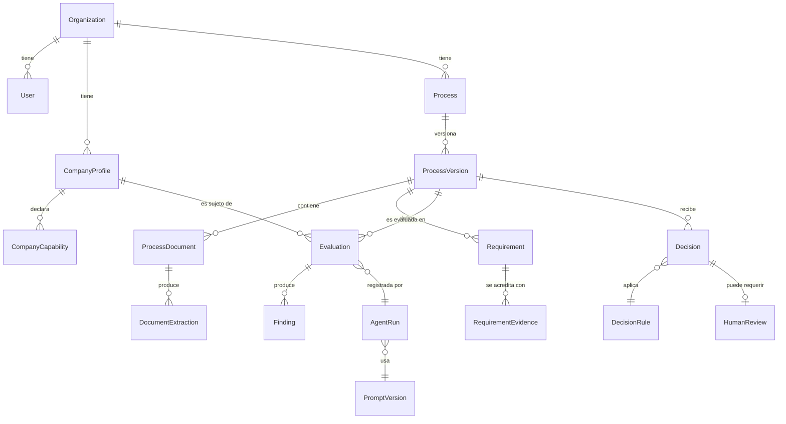

# Modelo de dominio — PliegoCheck-SECOP

Entidades conceptuales iniciales de la plataforma. Este documento define **conceptos**, no tablas: el esquema físico (PostgreSQL + Alembic) se derivará de aquí en las microfases de implementación.

Convenciones de este documento, aplicables a toda entidad:

- **Requiere evidencia:** dato que solo puede afirmarse con un documento, registro o fuente verificable asociada.
- **Puede inferirse:** dato que un agente puede derivar, siempre marcado como inferencia y con la fuente del razonamiento.
- **Nunca debe inventarse:** dato que, si no existe evidencia, queda `UNKNOWN` y jamás se rellena con un valor plausible.

---

## Entidades

### Organization
**Propósito:** tenant de la plataforma; agrupa usuarios, empresas y procesos con aislamiento completo entre organizaciones.

- **Campos conceptuales:** nombre, identificador, estado, configuración.
- **Relaciones:** tiene `User`s, `CompanyProfile`s, `Process`es.
- **Requiere evidencia:** ninguno (dato administrativo).
- **Puede inferirse:** ninguno.
- **Nunca debe inventarse:** n/a.

### User
**Propósito:** persona que opera la plataforma dentro de una organización.

- **Campos conceptuales:** identidad, correo, rol (p. ej. administrador, analista, revisor), estado.
- **Relaciones:** pertenece a una `Organization`; realiza `HumanReview`s; genera `AuditEvent`s.
- **Requiere evidencia:** ninguno.
- **Puede inferirse:** ninguno.
- **Nunca debe inventarse:** n/a.

### CompanyProfile
**Propósito:** perfil de la empresa que evalúa participar: su capacidad jurídica, financiera, técnica y de experiencia.

- **Campos conceptuales:** razón social, NIT, RUP (estado y clasificaciones), códigos UNSPSC inscritos, indicadores financieros por corte (liquidez, endeudamiento, capital de trabajo, patrimonio, etc.), fecha de corte de la información.
- **Relaciones:** pertenece a una `Organization`; tiene `CompanyCapability`s y `RequirementEvidence`s; es sujeto de `Evaluation`s.
- **Requiere evidencia:** todos los indicadores financieros, el estado del RUP, la experiencia declarada — cada valor debe apuntar a un documento soporte (estados financieros, certificado RUP, certificaciones de experiencia).
- **Puede inferirse:** indicadores derivados aritméticamente de valores con evidencia (p. ej. capital de trabajo = activo corriente − pasivo corriente), marcados como derivados.
- **Nunca debe inventarse:** indicadores financieros, vigencia del RUP, códigos UNSPSC inscritos, montos de experiencia.

### Process
**Propósito:** proceso de contratación de SECOP II bajo análisis.

- **Campos conceptuales:** identificador SECOP, entidad contratante, objeto, modalidad, presupuesto oficial, códigos UNSPSC del proceso, fuente de ingesta (datos abiertos / manual), estado del análisis.
- **Relaciones:** pertenece a una `Organization`; tiene `ProcessVersion`s; es objeto de `Evaluation`s y `Decision`s.
- **Requiere evidencia:** presupuesto, cronograma, modalidad — con referencia al documento o registro de datos abiertos de origen.
- **Puede inferirse:** clasificación temática del objeto, marcada como inferencia.
- **Nunca debe inventarse:** identificador SECOP, presupuesto, fechas del cronograma.

### ProcessVersion
**Propósito:** instantánea versionada del proceso. Las adendas y documentos nuevos crean una versión nueva; los análisis siempre referencian una versión concreta.

- **Campos conceptuales:** número de versión, fecha, causa (publicación inicial, adenda, documento nuevo), resumen de cambios.
- **Relaciones:** pertenece a un `Process`; tiene `ProcessDocument`s y `Requirement`s; las `Decision`s apuntan a una versión.
- **Requiere evidencia:** la causa de la versión (la adenda o documento que la originó).
- **Puede inferirse:** el resumen de cambios entre versiones, marcado como generado.
- **Nunca debe inventarse:** contenido de adendas no recibidas.

### ProcessDocument
**Propósito:** documento del proceso (pliego, anexo, formato, adenda, estudio previo) almacenado de forma inmutable.

- **Campos conceptuales:** nombre, tipo documental, hash del archivo, formato (PDF/DOCX/XLSX/imagen), origen (datos abiertos / carga manual), fecha de incorporación, ruta de almacenamiento.
- **Relaciones:** pertenece a una `ProcessVersion`; tiene `DocumentExtraction`s; es fuente de `Requirement`s y `RequirementEvidence`s.
- **Requiere evidencia:** es en sí mismo evidencia primaria; su integridad se garantiza por hash.
- **Puede inferirse:** el tipo documental (clasificación), marcado como inferencia hasta confirmación.
- **Nunca debe inventarse:** contenido de páginas ilegibles o faltantes (se marcan como no extraíbles).

### DocumentExtraction
**Propósito:** resultado de extraer el contenido de un `ProcessDocument` (texto, tablas, estructura), con calidad medida.

- **Campos conceptuales:** método de extracción (texto nativo, OCR), contenido estructurado por página/sección, métricas de calidad, páginas fallidas, versión del extractor.
- **Relaciones:** pertenece a un `ProcessDocument`; es insumo de `Requirement`s.
- **Requiere evidencia:** n/a (es un derivado técnico del documento).
- **Puede inferirse:** estructura de secciones, marcada con confianza.
- **Nunca debe inventarse:** texto de páginas que no pudieron extraerse — se registran como fallidas.

### Requirement
**Propósito:** requisito normalizado del proceso (habilitante, técnico, económico, etc.), unidad central del análisis. Su esquema operativo está en [decision-engine.md](decision-engine.md).

- **Campos conceptuales:** categoría, descripción normalizada, documento y ubicación de origen (página, sección), criticidad, subsanabilidad, valor esperado, estado de cumplimiento, confianza, indicador de revisión humana.
- **Relaciones:** pertenece a una `ProcessVersion`; proviene de un `ProcessDocument`; tiene `RequirementEvidence`s y `Finding`s; es evaluado en `Evaluation`s.
- **Requiere evidencia:** su existencia misma — todo requisito apunta a documento, página y sección de origen.
- **Puede inferirse:** categoría y criticidad propuestas por el agente normalizador, marcadas con confianza.
- **Nunca debe inventarse:** requisitos que no aparecen en los documentos; valores esperados no escritos en el pliego; subsanabilidad no determinable (queda `UNKNOWN`).

### RequirementEvidence
**Propósito:** vínculo verificable entre un requisito y el soporte de la empresa (o del proceso) que lo acredita o contradice.

- **Campos conceptuales:** tipo de evidencia, referencia al documento soporte y su ubicación, valor acreditado, sentido (soporta / contradice), fecha de validez.
- **Relaciones:** conecta `Requirement` con documentos de `CompanyProfile` o `ProcessDocument`s.
- **Requiere evidencia:** es evidencia por definición; sin documento asociado no existe.
- **Puede inferirse:** nada.
- **Nunca debe inventarse:** ninguna evidencia; una evidencia sin documento verificable es una violación del modelo.

### CompanyCapability
**Propósito:** capacidad estructurada de la empresa (experiencia por tipo de obra/servicio, equipo disponible, capacidad operativa) usada para contrastar contra requisitos.

- **Campos conceptuales:** tipo de capacidad, descripción, magnitud (monto, cantidad, años), soportes asociados, vigencia.
- **Relaciones:** pertenece a un `CompanyProfile`; se referencia desde `Evaluation`s y `RequirementEvidence`s.
- **Requiere evidencia:** toda magnitud (montos de experiencia, certificaciones, hojas de vida del equipo).
- **Puede inferirse:** agregaciones (p. ej. suma de experiencia por código UNSPSC), marcadas como derivadas.
- **Nunca debe inventarse:** experiencia, certificaciones o equipo no soportados documentalmente.

### Evaluation
**Propósito:** resultado de un agente evaluador especializado sobre un conjunto de requisitos de una versión del proceso contra un perfil de empresa.

- **Campos conceptuales:** tipo de evaluación (jurídica, financiera, experiencia, técnica, operativa, económica), estado por requisito, hallazgos, `AgentRun` asociado.
- **Relaciones:** referencia `ProcessVersion`, `CompanyProfile`, `Requirement`s; produce `Finding`s; es insumo del motor de decisión.
- **Requiere evidencia:** cada estado de cumplimiento asignado debe referenciar `RequirementEvidence`s.
- **Puede inferirse:** los estados propuestos, siempre con confianza y evidencia citada.
- **Nunca debe inventarse:** cumplimientos sin evidencia (el estado correcto es `UNKNOWN`).

### Finding
**Propósito:** hallazgo puntual y trazable producido durante una evaluación: incumplimiento, riesgo, conflicto de evidencia, dato faltante.

- **Campos conceptuales:** tipo, severidad, descripción, requisito asociado, evidencia citada, recomendación.
- **Relaciones:** pertenece a una `Evaluation`; referencia `Requirement` y `RequirementEvidence`s.
- **Requiere evidencia:** todo hallazgo cita la evidencia que lo motiva.
- **Puede inferirse:** la severidad propuesta, revisable por humanos.
- **Nunca debe inventarse:** hallazgos sin base documental.

### Decision
**Propósito:** decisión final auditable sobre un proceso para una empresa, producida por el motor determinístico.

- **Campos conceptuales:** resultado (`GO`, `GO_CONDICIONADO`, `BUSCAR_ALIADO`, `NO_GO`, `NO_CARGAR`, `PENDIENTE_INFORMACION`), requisitos determinantes, condiciones (si aplica), versión de reglas usada (`DecisionRule`), versiones de prompts y modelos involucrados, fecha, estado de revisión humana.
- **Relaciones:** referencia `ProcessVersion`, `CompanyProfile`, `Evaluation`s, `DecisionRule` y `HumanReview` cuando exista.
- **Requiere evidencia:** cada factor determinante de la decisión apunta a requisitos y evidencia concretos.
- **Puede inferirse:** nada — la decisión es producto determinístico de reglas versionadas.
- **Nunca debe inventarse:** una decisión sin cadena completa requisito → evidencia → evaluación → regla.

### DecisionRule
**Propósito:** versión inmutable del conjunto de reglas del motor determinístico usado para producir decisiones.

- **Campos conceptuales:** versión, contenido de reglas, fecha de vigencia, changelog.
- **Relaciones:** referenciada por `Decision`s.
- **Requiere evidencia:** n/a (artefacto del sistema, versionado en el repositorio).
- **Puede inferirse:** nada.
- **Nunca debe inventarse:** n/a; las reglas solo cambian por gestión de cambios documentada.

### AgentRun
**Propósito:** registro de una ejecución concreta de un agente de IA: qué modelo, qué prompt, qué entradas, qué salida, qué costo.

- **Campos conceptuales:** agente, `PromptVersion` usada, modelo y versión, entradas (referencias), salida estructurada, tokens consumidos, duración, errores, resultado de validación de esquema.
- **Relaciones:** referencia `PromptVersion`; es referenciado por `DocumentExtraction`s, `Evaluation`s y `Decision`s.
- **Requiere evidencia:** n/a (es el registro de auditoría técnica).
- **Puede inferirse:** nada.
- **Nunca debe inventarse:** métricas de ejecución; se registran las reales.

### PromptVersion
**Propósito:** versión inmutable de un prompt de agente, para reproducibilidad.

- **Campos conceptuales:** agente al que pertenece, versión, contenido, esquema de salida asociado, fecha, changelog.
- **Relaciones:** referenciada por `AgentRun`s.
- **Requiere evidencia:** n/a.
- **Puede inferirse:** nada.
- **Nunca debe inventarse:** n/a.

### HumanReview
**Propósito:** revisión humana de una decisión, evaluación o conflicto de evidencia; requisito obligatorio para decisiones críticas.

- **Campos conceptuales:** revisor, objeto revisado, veredicto (confirma, corrige, rechaza), justificación, fecha.
- **Relaciones:** realizada por un `User`; referencia `Decision`, `Evaluation` o `Finding`.
- **Requiere evidencia:** la justificación del revisor queda registrada.
- **Puede inferirse:** nada.
- **Nunca debe inventarse:** una revisión humana jamás se simula ni se autocompleta.

### AuditEvent
**Propósito:** evento inmutable de auditoría de toda acción relevante (ingesta, extracción, evaluación, decisión, revisión, cambios de perfil).

- **Campos conceptuales:** actor (usuario o agente), acción, objeto, timestamp, detalle.
- **Relaciones:** referencia cualquier entidad del sistema.
- **Requiere evidencia:** n/a (es el mecanismo de evidencia del sistema).
- **Puede inferirse:** nada.
- **Nunca debe inventarse:** n/a; los eventos no se editan ni se eliminan.

---

## Diagrama de relaciones principales

---

## Categorías iniciales de requisitos

| Categoría | Ejemplos típicos |
| --- | --- |
| Jurídicos | Existencia y representación legal, inhabilidades e incompatibilidades, paz y salvos, sanciones. |
| Financieros | Índice de liquidez, nivel de endeudamiento, razón de cobertura de intereses, capital de trabajo, patrimonio. |
| Organizacionales | Indicadores de capacidad organizacional (rentabilidad del patrimonio y del activo). |
| Experiencia | Contratos acreditables, montos en SMMLV, códigos UNSPSC, experiencia específica y general. |
| Técnicos | Especificaciones del bien/servicio, normas técnicas, metodologías, certificaciones de calidad. |
| Equipo de trabajo | Perfiles, formación, experiencia y dedicación del personal mínimo exigido. |
| Garantías | Seriedad de la oferta, cumplimiento, calidad, salarios, responsabilidad civil. |
| Cronograma | Fechas de cierre, audiencias, subsanación, adjudicación; plazos de ejecución. |
| Económicos | Presupuesto oficial, forma de pago, anticipos, estructura de precios, AIU. |
| Operativos | Capacidad instalada, cobertura geográfica, logística, disponibilidad de equipos. |
| Documentales | Formatos exigidos, cartas, anexos diligenciados, certificaciones a presentar. |
| Riesgos e inhabilidades | Matriz de riesgos del proceso, causales de rechazo, conflictos de interés. |

> **Aclaración obligatoria:** los umbrales (p. ej. índice de liquidez mínimo), los documentos exigidos y las causales de rechazo o subsanabilidad **dependen de cada proceso concreto y de su pliego**. Ningún valor observado en un caso específico debe convertirse en regla universal del sistema. Las reglas del motor determinístico operan sobre los valores extraídos de cada pliego, no sobre umbrales fijos codificados.
